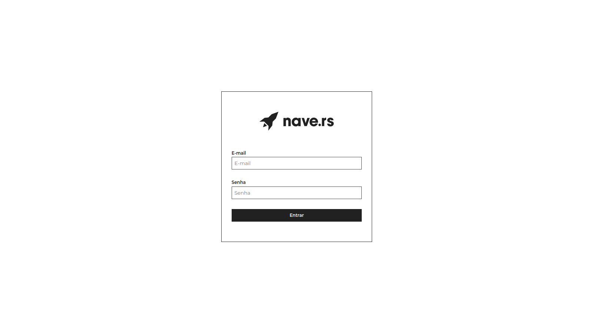
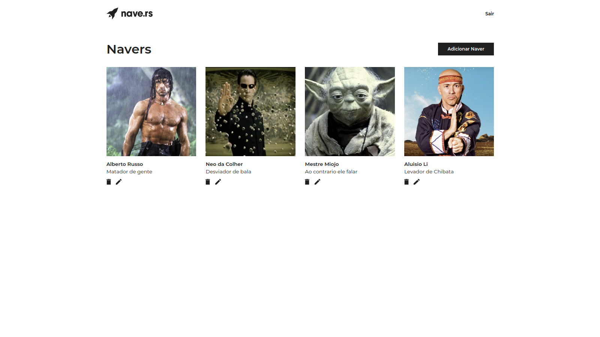
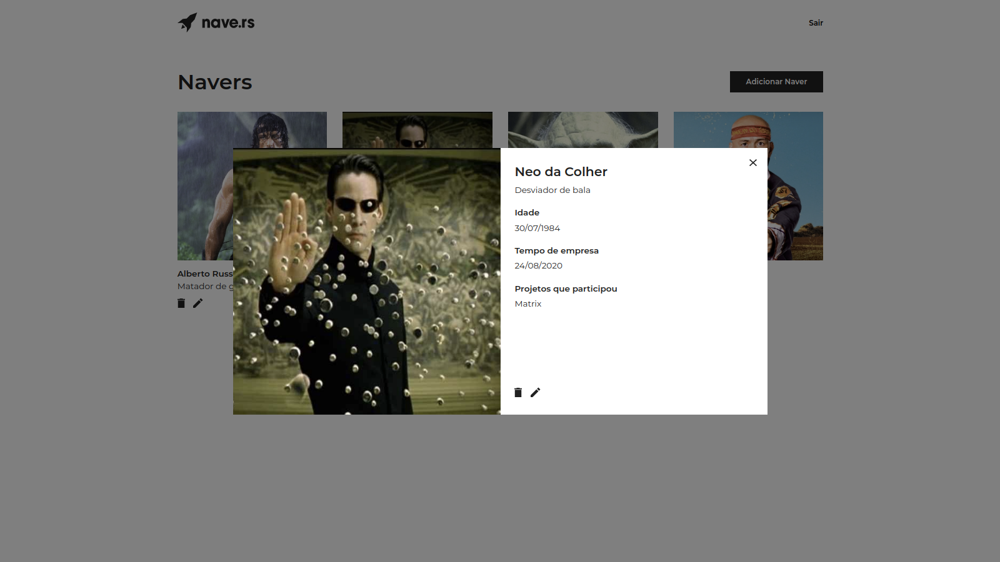

<h1 align="center">

NAVEDEX

</h1>
 
 
  

    

  

  
  

 
 
 

Project test to at Naver.rs, using navedex-api + React

  

### Getting started

- In your terminal, run the steps:

> `git clone https://github.com/evandersondev/navedex`

> `cd navedex`

> `yarn` or `npm install` **for install the modules**.

> `yarn start` or `npm run start`.

> You can access in your browser the web application http://localhost:3000.

> Online application at **<a href="https://navedexrs.netlify.app/" target="_blank">PokFinder</a>**

## Features

[//]: # 'Add the features of your project here:'

Features used in the Project.

- **<a href="https://pt-br.reactjs.org/docs/getting-started.html" target="_blank">React Js</a>** — A JavaScript library for building user interfaces

### - LICENSE

This project is licensed under the MIT License - see the <a href="https://opensource.org/licenses/MIT" target="_blank">LICENSE</a> page for details.
